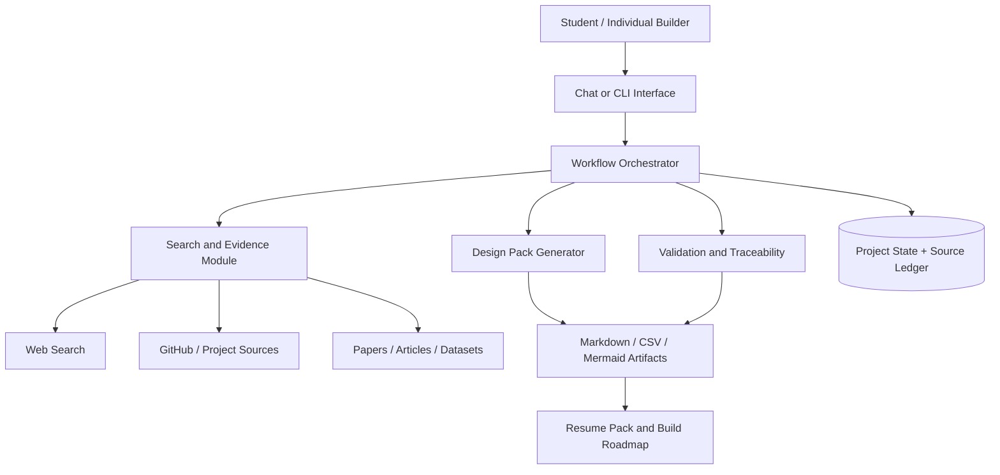

# Product Spec and Resume Positioning

## Product thesis

Most project-idea tools optimize for generating more ideas. This product optimizes for making a defensible build decision and producing a traceable plan. Its differentiator is the connection between external evidence, scope, effort/cost, architecture, and honest resume claims.

## Target users

- Students selecting course, capstone, hackathon, or portfolio projects
- Early-career developers who need a project they can explain in interviews
- Individual builders testing a side-project idea under time and budget limits

## Jobs to be done

1. Tell me whether my idea already exists and show me the closest references.
2. Help me find a sharper angle instead of discarding the idea immediately.
3. Reduce the idea to an MVP I can actually finish.
4. Explain the likely effort, monetary cost, and architecture before I code.
5. Give me a design trail I can show and discuss in an interview.

## How the workflow was simplified

| Process-heavy planning workflow | Project Brainstorming Agent |
|---|---|
| Formal intake document | Rough personal project idea |
| Many gated delivery stages | Five lightweight decision/design stages |
| Multiple organizational roles | One builder, mentor, reviewer, or recruiter |
| Administrative approval steps | Evidence-backed novelty and feasibility decision |
| Long-form design package | Lightweight SDD and implementation roadmap |
| Mandatory testing document | Evaluation evidence only when it exists |
| Fixed-format summary document | Resume evidence pack and demo narrative |
| Single-point effort estimates | Low/likely/high person-day and cost ranges |

## MVP architecture



## Traceability model

```text
Source URL -> Evidence ID -> Pain/Opportunity -> FR/NFR -> FL item
           -> Architecture component -> Test/Evaluation -> Resume claim
```

This chain is the strongest portfolio feature because it makes the agent's output auditable rather than merely fluent.

## MVP evaluation

Use 10-20 representative ideas across software, data, AI, and non-AI domains. Measure:

- citation validity rate;
- comparable-project relevance judged by a human;
- requirement-to-function traceability coverage;
- estimate consistency and monotonicity;
- percentage of architecture components mapped to requirements;
- time from raw idea to accepted plan;
- user rating of scope clarity before vs. after the workflow.

Do not claim these metrics until the evaluation has actually run.

## Resume framing

### Current, truthful version

Designed an evidence-first Project Brainstorming Agent that converts rough student project ideas into research-backed Go/Pivot/Stop decisions, lightweight SDDs, costed functional plans, and traceable system architectures.

### Stronger version after an MVP exists

- Built a workflow-based AI agent that searches and compares existing projects before generating a scoped implementation plan, reducing idea-to-design work from a manual multi-document process to one traceable pipeline.
- Implemented requirement IDs and a source ledger linking web evidence to features, person-day/cost estimates, architecture components, and evaluation criteria.
- Evaluated the agent across `[N]` project ideas, achieving `[verified metric]` citation validity and reducing median planning time from `[baseline]` to `[result]`.

Replace bracketed values only with measured results.

## Recommended repository milestones

1. `v0.1 Spec`: workflow, schemas, sample output, and architecture.
2. `v0.2 Search`: live search with source ledger and similarity matrix.
3. `v0.3 Design Pack`: SDD, functional list, effort/cost, and Mermaid architecture.
4. `v0.4 Evaluation`: golden idea set, rubric, automated validators, and results.
5. `v1.0 Demo`: reproducible CLI/web flow, example projects, screenshots, and short video.
