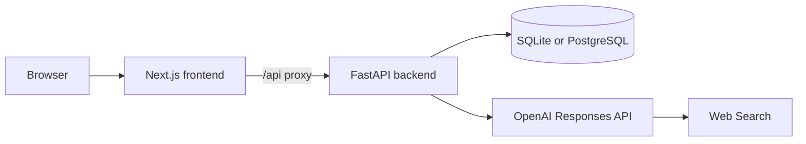

# Idea Atelier — Project Brainstorming Agent

Idea Atelier turns a rough project idea into an evidence-backed, costed, and traceable implementation plan. It guides the user through five approval stages, preserves every generated version, and exports the completed project as a reusable ZIP package.

**Live application:** [idea-atelier-web.onrender.com](https://idea-atelier-web.onrender.com)

> The public deployment is an invite-only beta. Free Render services can take about one minute to wake after a period of inactivity.

## What it does

The workflow develops an idea in five stages:

1. **Idea brief** — clarifies the problem, users, constraints, assumptions, and success criteria.
2. **Research and decision** — searches the web, compares relevant products and resources, and recommends `GO`, `PIVOT`, or `STOP`.
3. **Function plan** — defines traceable function IDs, MVP/Standard/Stretch scope, dependencies, effort estimates, and cost ranges.
4. **Interactive prototype** — generates a browser-based HTML prototype while identifying mocked behavior.
5. **Architecture** — maps accepted requirements to components, data flow, integrations, deployment, security, trade-offs, and cost.

Each stage can be generated, revised with feedback, and explicitly accepted. Changing an upstream artifact invalidates dependent stages without deleting their history.

## Highlights

- English web interface built with Next.js and TypeScript.
- FastAPI backend with strict Pydantic validation.
- OpenAI Responses API with Web Search and Structured Outputs.
- Demo mode for exploring the workflow without an API key or live research.
- Live mode with saved search sources, queries, citations, timestamps, and raw reports.
- SQLite for local development and PostgreSQL for deployed environments.
- Invite-only accounts, hashed passwords, opaque HttpOnly sessions, and per-user project isolation.
- Configurable daily live-generation quota.
- Background generation with concurrent-run protection and restart recovery.
- Markdown, tables, Mermaid diagrams, sandboxed HTML prototypes, and JSON rendering.
- ZIP export containing current artifacts, complete version history, source metadata, CSV estimates, prototype HTML, and Mermaid source.

## Architecture



The browser communicates with the Next.js origin. Next.js proxies `/api/*` requests to FastAPI, keeping authentication cookies first-party. The backend owns all model calls and database access; the OpenAI API key is never sent to the browser or stored in the database.

## Technology stack

| Layer | Technology |
| --- | --- |
| Frontend | Next.js 15, React 19, TypeScript, Mermaid |
| Backend | FastAPI, Pydantic, SQLAlchemy, Alembic |
| AI | OpenAI Responses API, Web Search, Structured Outputs |
| Local database | SQLite |
| Production database | PostgreSQL |
| Deployment | Render Blueprint |
| Testing | Pytest, Next.js production build, TypeScript |

## Repository layout

```text
.
├── README.md                         Project overview
├── render.yaml                      Render deployment blueprint
├── v2/                              Standalone full-stack application
│   ├── frontend/                    Next.js App Router frontend
│   ├── backend/app/                 FastAPI application and workflow
│   ├── backend/migrations/          Alembic database migrations
│   ├── backend/tests/               Auth, provider, and workflow tests
│   ├── setup.ps1                    Windows dependency setup
│   ├── start.ps1                    Windows development launcher
│   ├── README.md                    Detailed V2 operations guide
│   └── VALIDATION.md                Verification record and boundaries
└── Project Brainstorming Agent/     Original V1 Codex-native workflow
```

## Run locally on Windows

Requirements:

- Python 3.11 or newer
- Node.js 20.9 or newer
- pnpm

From PowerShell:

```powershell
cd v2
./setup.ps1
Copy-Item .env.example .env
./start.ps1
```

Open [http://127.0.0.1:3000](http://127.0.0.1:3000). The local backend runs at `http://127.0.0.1:8000`, with interactive API documentation at `http://127.0.0.1:8000/docs`.

Demo mode works without an OpenAI API key. To use Live mode, add a valid key to `v2/.env` and restart the application.

## Run locally on macOS or Linux

Start the backend:

```bash
cd v2
python -m venv .venv
source .venv/bin/activate
python -m pip install -r backend/requirements.lock.txt
cd backend
python -m uvicorn app.main:app --host 127.0.0.1 --port 8000
```

Start the frontend in another terminal:

```bash
cd v2/frontend
pnpm install --frozen-lockfile
pnpm dev
```

## Environment variables

Copy [`v2/.env.example`](v2/.env.example) to `v2/.env` for local development. Never commit real secrets.

| Variable | Purpose | Local default |
| --- | --- | --- |
| `OPENAI_API_KEY` | Enables Live generation and Web Search | Empty |
| `OPENAI_MODEL` | Responses API model | `gpt-5.5` |
| `DATABASE_PATH` | Local SQLite file | `data/brainstorm.db` |
| `DATABASE_URL` | PostgreSQL connection string; overrides `DATABASE_PATH` | Empty |
| `AUTH_REQUIRED` | Requires account authentication | `false` |
| `ALLOW_SIGNUPS` | Enables registration | `true` |
| `INVITE_CODE` | Required registration code when production signups are enabled | Empty |
| `COOKIE_SECURE` | Sends session cookies over HTTPS only | `false` |
| `SESSION_DAYS` | Session lifetime in days | `30` |
| `DAILY_GENERATION_LIMIT` | Per-account daily Live requests; `0` disables the limit | `0` |
| `CORS_ORIGINS` | Comma-separated allowed browser origins | Local origins |
| `TRUSTED_HOSTS` | Comma-separated accepted hostnames | Local hosts |
| `API_ORIGIN` | Backend URL used by the Next.js API proxy | `http://127.0.0.1:8000` |

Production secrets belong in Render's **Environment** settings. The repository intentionally excludes `.env`, `.env.local`, local databases, dependency folders, and build output.

## Deploy on Render

The root [`render.yaml`](render.yaml) provisions:

- `idea-atelier-web` — Next.js frontend
- `idea-atelier-api` — FastAPI backend
- `idea-atelier-db` — PostgreSQL database

Deployment steps:

1. Fork or push this repository to GitHub.
2. Create a Render Blueprint from `render.yaml`.
3. Enter `OPENAI_API_KEY` and a long random `INVITE_CODE` when prompted.
4. Let Render create and deploy all three resources.
5. Open the frontend URL and register through **Have an invite? Create an account**.

The Blueprint supplies `DATABASE_URL`, runs Alembic migrations when the API starts, enables secure authentication cookies, and sets a default limit of 20 Live generations per account per UTC day.

Render's free web services sleep after inactivity. Free Render PostgreSQL databases also have a limited lifetime, so upgrade or migrate the database before it expires if the stored accounts and projects must be retained.

## Validation

Run the backend suite from `v2/backend`:

```powershell
../.venv/Scripts/python.exe -m pytest -q
```

Run frontend checks from `v2/frontend`:

```bash
pnpm typecheck
pnpm build
```

Current verification: **16 backend tests pass**, the TypeScript check passes, and the Next.js production build completes successfully. See [`v2/VALIDATION.md`](v2/VALIDATION.md) for tested scenarios and known boundaries.

## Security notes

- Keep `OPENAI_API_KEY`, `INVITE_CODE`, database credentials, and `.env` files out of Git.
- Live generation consumes OpenAI API credits; failed requests are not automatically retried.
- Password reset, email verification, billing, admin screens, distributed workers, penetration testing, and load testing are outside the current beta scope.
- Generated prototype code is sandboxed inside the app. Review exported HTML before opening or publishing it independently.

## Versions

- **V2 — Idea Atelier:** the deployable Next.js and FastAPI application described above. See the [detailed V2 guide](v2/README.md).
- **V1 — Codex-native workflow:** the original Skills and Python workflow implementation. See the [V1 documentation](Project%20Brainstorming%20Agent/README.md).

## License

No open-source license has been added. All rights are reserved by the repository owner unless a license is added later.
