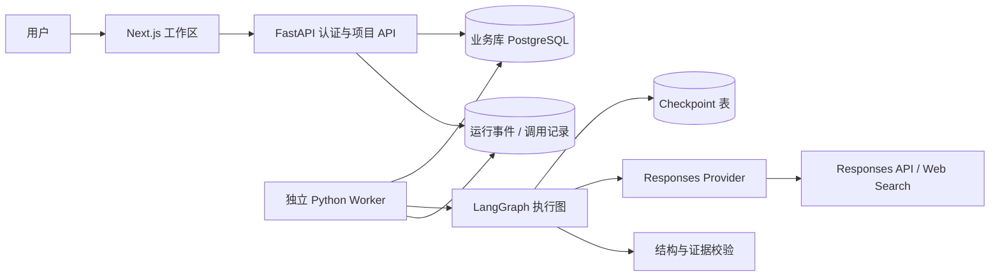
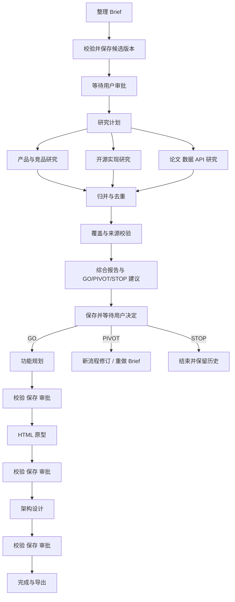

# Idea Atelier V3 设计草案

日期：2026-09-12。状态：完整 V3 设计；基础版已部分实现，交付范围见 [V3_BASIC_RELEASE.md](V3_BASIC_RELEASE.md)。基于当前 V2 的 FastAPI、Next.js、Responses API、SQLAlchemy、SQLite/PostgreSQL 与五阶段审批流程。

## 1. 目标与范围

V3 的目标是让耗时研究和五阶段生成可观察、可暂停、可恢复，并通过有边界的并行研究改善证据覆盖。LangGraph 管理执行；业务数据库继续管理项目、版本和审批。

现有代码依据：`v2/backend/app/main.py` 使用 FastAPI BackgroundTasks 执行生成；`provider.py` 在研究阶段先搜索再生成结构化报告；`db.py` 已保存项目、artifact 和 run，并限制每个项目一个 running run。V2 文档注明进程重启将中断运行标为失败，真实 Ideas 质量评估尚未完成。

### 功能范围

| ID | 功能 | V3 MVP 验收条件 |
|---|---|---|
| V3-01 | 持久化执行与恢复 | 重启后已持久化的成功节点不重复执行；不确定的外部调用进入人工处理状态 |
| V3-02 | 并行研究 | 产品、开源实现、论文/数据/API 三类研究独立记录结果与失败，可单独重试 |
| V3-03 | 五阶段人工审批 | 生成后暂停；只有用户接受指定有效版本才进入下一阶段 |
| V3-04 | 修订与条件分支 | GO 继续，PIVOT 新建流程修订，STOP 结束；上游修订使下游失效 |
| V3-05 | 证据检查 | 外部断言能关联实际工具来源；无来源结果不能标为已验证 |
| V3-06 | 运行进度与控制 | 显示节点、错误、等待事项；支持节点边界暂停、取消、手动重试 |
| V3-07 | 用量与预算 | 记录各调用 usage；达到预算前阻止新调用；费用未知时明确显示未知 |
| V3-08 | 向后兼容与导出 | V2 项目可读取和导出；V3 导出增加研究分支、检查结果和运行摘要 |

MVP 不引入自由对话式 Agent 团队、RAG、Redis、Kubernetes 或任意工具执行。三个研究角色是固定职责的节点，可共享模型。它们通过结构化证据交换数据，不相互聊天。

## 2. 系统架构



生产使用 PostgreSQL：业务、checkpoint 和事件可以位于同一数据库的不同表，但不能假设 LangGraph checkpoint 与业务提交天然共享一个原子事务。本地保留 SQLite，先限制一个 worker；通过兼容适配器接入对应 checkpointer。

独立 worker 是 V3 的必要组件：避免浏览器请求或 API 部署生命周期直接管理长任务。首版由 PostgreSQL run 表承担持久化调度，不另建消息队列。

| 组件 | 职责与功能映射 | 输入/输出与故障行为 |
|---|---|---|
| Next.js | V3-03/04/06/07/08：审批、运行时间线、预算与导出 | 通过同源 API；断线重新读取持久化事件；不持有密钥 |
| FastAPI 业务服务 | V3-03/04/06/08：认证、授权、版本锁、命令入库 | 用户请求→事务记录；提交后返回 202；不直接执行长生成 |
| Worker | V3-01/02/06/07：领取、调度、租约与并发限制 | run→执行结果与事件；租约失效后由其他 worker 接管 |
| LangGraph | V3-01/02/03/04：节点路由、checkpoint、interrupt | 固定输入快照→候选 artifact；通过身份校验后的业务命令恢复 |
| Provider | V3-02/07：搜索与结构化生成、usage 收集 | 复用 V2 SDK 适配层；超时/拒绝/限额分类；密钥仅在服务端 |
| 校验器 | V3-05/08：Pydantic、FL-ID、来源和覆盖检查 | 明确错误列表；结构失败不能提交有效候选版本 |
| 数据库/Checkpointer | V3-01/03/04/06/07/08：权威业务记录与执行状态 | 唯一键、事务、备份、幂等提交；checkpoint 无审批决定权 |

## 3. 执行图与审批



所有审批节点都支持“修改后重新生成”，该路径返回本阶段生成节点。前端可选择接受后自动排队下一阶段，或留在暂停状态；默认沿用 V2 的用户主动触发习惯。

审批使用 LangGraph `interrupt()`，但审批节点之前必须完成候选版本的幂等保存。恢复时审批节点可能重新执行，因此其中不放模型调用、生成版本或其他非幂等副作用。官方依据：[Interrupts](https://docs.langchain.com/oss/python/langgraph/interrupts)。

研究计划限定最多三分支、各自查询预算与覆盖目标。论文/数据分支可以声明不适用并给出原因。单分支失败允许保留其他结果；用户可重试该分支，或确认采用明确标注的覆盖不足报告。不能静默生成“全面研究”结论。

默认不进行无限补搜或无限模型自修复。确定性校验先运行；需要额外模型调用时计入预算，并要求明确的重试命令。MVP 不增加独立 LLM reviewer，后续通过质量评估决定是否值得加入。

## 4. 状态与数据所有权

GraphState 保存 JSON 可序列化字段和引用，避免复制完整历史或密钥：

```text
project_id, workflow_id, workflow_revision, graph_version
stage, run_id, input_snapshot_id, accepted_artifact_ids
research_plan, branch_result_ids, candidate_artifact_id
validation_issues, pending_approval_id, budget_policy_id
```

并行分支结果采用以 branch_id 为键的确定性 reducer，禁止多个分支覆盖同一个标量字段。研究文本和 HTML 保存在业务库，通过 ID 引用；审批恢复前重新确认输入快照与当前有效版本一致。

LangGraph `thread_id` 使用服务端生成的 workflow_id。它不是用户 ID，也不是授权凭据。每次 API 操作先验证项目所有权，客户端不能指定任意 thread_id 或 checkpoint。Checkpointer 负责执行快照；业务 artifacts 和 approvals 是用户可见事实的权威来源。官方依据：[Persistence](https://docs.langchain.com/oss/python/langgraph/persistence)。

### 增量数据表

保留 users、sessions、projects、artifacts、runs；增加以下表，并使用 Alembic 迁移。

| 表 | 关键字段与约束 |
|---|---|
| workflows | id, project_id, revision, graph_version, status；项目修订唯一 |
| run_steps | run_id, node_key, attempt, input_hash, status, output_ref, timestamps；节点尝试唯一 |
| llm_calls | call_key, run_id, node_key, response_id, status, usage_json, reserved_budget, error_code；call_key 唯一 |
| evidence | id, run_id, branch_id, url, title, retrieved_at, tool_response_id, raw_report_ref |
| claims | id, artifact_id, text, evidence_ids, verification_state；仅来源存在不等于断言得到支持 |
| approvals | id, artifact_id, workflow_revision, expected_version, action, feedback, actor_id, created_at；消费命令幂等 |
| run_events | run_id, sequence, type, node_key, safe_payload, created_at；run 与 sequence 唯一 |
| run_commands | idempotency_key, run_id, type, payload, processed_at；用于恢复/暂停/取消/重试 |

runs 增加 workflow_id、engine、lease_owner、lease_until、heartbeat_at、cancel_requested、input_snapshot_id。active 状态覆盖 queued/running/recovering；waiting_approval 不占 worker 租约。每项目最多一个活动流程，审批等待期间仍禁止冲突生成。原来的 `status='running'` 唯一索引必须迁移，不能直接沿用。

输入快照固定 idea、constraints、已接受版本、feedback、模型、prompt/schema/graph 版本与预算策略。上游修订创建新 workflow_revision，旧暂停图标为 superseded；不能恢复旧 checkpoint 写入新修订。

## 5. Worker、恢复与副作用

Worker 在事务中领取 queued run；PostgreSQL 通过行锁与 SKIP LOCKED 避免重复领取，租约建议 60 秒、心跳 15 秒，均可配置。每个领取生成递增 fencing token；写事件、提交版本和完成运行时必须匹配当前 token，防止过期 worker 迟到覆盖。

恢复步骤：领取租约→检查流程修订与 graph_version→读取 checkpoint→核对调用记录→恢复可安全执行的节点→幂等提交候选版本→更新业务状态。审批命令采用持久化 outbox 风格：API 保存命令，worker 消费；重放不会重复审批或创建版本。

Checkpoint 不提供外部 API 的 exactly-once 保证。模型请求已发出、结果尚未本地保存时进程崩溃，可能无法判断是否计费。`llm_calls` 先记录 started，完成后持久化结果；未知状态标为 needs_attention，告知用户可能已消费额度，用户决定重新调用。不要承诺恢复绝不重复计费，也不依赖尚未验证的提供商幂等能力。

候选 artifact 使用 `(workflow_id, stage, input_hash, generation_attempt)` 提交唯一键。模型结果先进入可复用调用记录，再由独立提交节点保存 artifact；checkpoint 和业务事务之间的间隙通过幂等提交及启动时对账处理。

取消是协作式：节点前后检查标记，停止新调用；已发出的远程请求不保证能撤回或退款。用户取消后不发布迟到结果。数据库重试与付费模型重试使用不同策略；保持 V2 无自动付费重试默认值。

升级执行图时保留旧 graph_version 的处理器，或明确标记旧流程需要从已接受 artifact 创建新流程；不把旧 checkpoint 直接交给不兼容的新图。

## 6. 证据与质量

沿用 `extract_evidence` 的信任边界：只有实际工具结果和 annotation 可以建立来源记录，生成文本中的链接不能自行变成证据。

研究分支输出固定 schema：summary、comparisons、claims、evidence_refs、coverage、limitations。归并时按规范化 URL 去重，同时保留分支与时间；冲突来源并列呈现。URL 必须与实际来源匹配，但这一检查只能证明来源被检索过，不能证明每个断言为真。UI 区分“有工具来源”“内容支持已检查”“推断”“待核实”。

网页内容作为不可信材料传递；不得改变系统规则、审批、预算或工具权限。MVP 继续使用内建搜索，不增加任意 URL 抓取器或本地代码执行。原型继续沿用 V2 沙箱，导出 HTML 显示现有说明。

## 7. API 与界面

保留 V2 项目、生成、接受和导出 API，通过服务层路由到 engine=v2/v3。新增：

| API | 用途 |
|---|---|
| GET /api/runs/{id} | 业务状态、节点摘要、预算与 pending approval |
| GET /api/runs/{id}/events?after={sequence} | 增量事件；MVP 使用轮询，后续可增加 SSE |
| POST /api/runs/{id}/commands | pause/resume/cancel/retry_branch；校验预期修订与幂等键 |
| POST /api/projects/{id}/approvals | 接受/修订/GO/PIVOT/STOP；指定 artifact_id 与 expected_version |
| GET /api/projects/{id}/evidence | 按阶段、分支、版本展示来源与覆盖 |

未授权返回 404/403；冲突修订返回 409；无预算或不可恢复状态返回明确业务错误。现有前端调用不被悄悄改变。

工作区增加：顶部运行状态；研究阶段三分支进度；来源和覆盖面板；底部审批卡片与用量摘要。暂停与取消含义必须准确。用户主要看到“竞品研究完成”“等待你确认”，技术 checkpoint 信息只在调试详情显示。

## 8. 预算、部署与可观测性

部署：沿用 Next.js 服务和 FastAPI 服务，新增一个常驻 Python worker，与 API 共享 PostgreSQL。生产 worker 的持续运行能力与费用需上线前核实，不依赖休眠服务自动唤醒。开发通过单 worker 和 SQLite 运行。

模型调用次数基线：V2 完整五阶段约六次请求（研究搜索与报告各一次）；V3 默认约八次（三次搜索、一次研究综合、其他四阶段各一次），实际工具调用和 tokens 另计，不把请求数等同于费用。

费用估算公式：输入 tokens × 输入单价 + 输出 tokens × 输出单价 + 搜索工具费用 + worker/数据库托管费用。价格不在代码中写死；保存有日期的价格配置，usage 缺失时记录估计或未知。

采用运行级预算与用户日额度两层限制。并发分支启动前事务预留预算；完成后对账。由于成本预估有误差，这属于应用控制阈值，不能声称为提供商账单硬上限。最大分支数默认 3，worker 同时运行项目数首版默认 1；经负载测试后调整。

事件记录节点开始/结束、重试、审批、租约接管、token usage 和安全错误码。日志不包含 API key、Cookie、密码或未经脱敏的用户正文。Checkpoint 含用户内容，必须纳入保留期、备份、项目删除与访问控制；业务删除时同步清理 checkpoint，不留孤立数据。

## 9. 实施与验证

| 顺序 | 交付 | 人日低/典型/高 |
|---|---|---|
| 1 | 拆分 V2 服务层，明确输入快照与引擎接口 | 2 / 3 / 5 |
| 2 | 数据迁移、run 命令、租约与幂等调用记录 | 3 / 5 / 8 |
| 3 | 单路径 LangGraph、checkpointer、审批恢复 | 3 / 5 / 8 |
| 4 | 三分支研究、来源归并与覆盖校验 | 3 / 4 / 7 |
| 5 | Worker、恢复对账、预算和取消 | 3 / 5 / 8 |
| 6 | 前端进度、控制、审批和证据界面 | 3 / 5 / 8 |
| 7 | 故障注入、迁移回归、部署与真实 Ideas 评估 | 4 / 6 / 10 |
| 合计 | 一位熟悉当前代码的开发者，含必要测试 | 21 / 33 / 54 |

估算为设计假设，不是工期承诺；不含 RAG、收费系统或开放注册产品化。典型约 6–7 工作周。

测试重点：重启前后节点恢复；三个并行分支单独失败；模型调用后 checkpoint 前崩溃；artifact 提交后重复执行；双 worker 租约竞争；重复审批；过期审批与上游修订；取消后的迟到结果；预算并发预留；跨用户 run/checkpoint 访问；V2 版本历史和导出回归。

选择 5–10 个真实 Ideas，使用同一输入比较 V2/V3：研究覆盖、可核实断言比例、人工修改次数、完成率、延迟、tokens 与费用。成功标准先设为：故障测试不丢已提交版本、不发布失效结果；质量指标不倒退；新增预算换来可观察的覆盖收益。具体质量阈值在取得 V2 基线后确定。

迁移先为新项目启用 V3 feature flag；V2 在途运行继续原引擎。旧项目从最后有效且已接受的 artifact 建立新流程快照，不能伪造历史 checkpoint。旧 demo 模式保留，并新增确定性分支失败/恢复场景。

建议目录：

```text
v2/backend/app/
  services/       项目、审批、版本、预算业务规则
  orchestration/ graph、state、nodes、reducers、checkpoint 适配器
  research/      plan、branches、merge、evidence_checks
  worker/        claim、leases、commands、recovery
  providers/     Responses 调用与记录适配器
```

沿用当前目录做增量升级，不复制整套 v3 应用。保留旧引擎直到真实项目验证通过。

## 10. 决策与替代方案

如果真实 Ideas 表明只需要简单失败重试，继续使用 Python 状态机加持久化 run 即可；LangGraph 的额外维护成本未必值得。此次 V3 选择它的具体依据是：多分支研究的独立恢复、五阶段持久化人工审批、条件分支与执行快照。

首版采用固定 StateGraph 和原生 OpenAI Provider，不要求整体改用 LangChain Agent。更复杂 Agent 协作、SSE、独立队列和 Vector Store 都作为后续选择；分别由证据缺口、界面实时性、调度瓶颈和历史资料检索需求触发。

仍需实施前确认：V2 真实质量基线、生产 worker 运行条件、依赖版本组合、SQLite/PostgreSQL checkpointer 集成行为及预算价格配置。这些不会阻止设计评审，但会影响上线验收。
